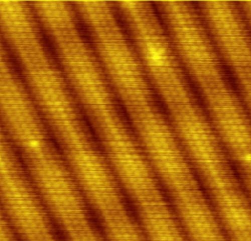
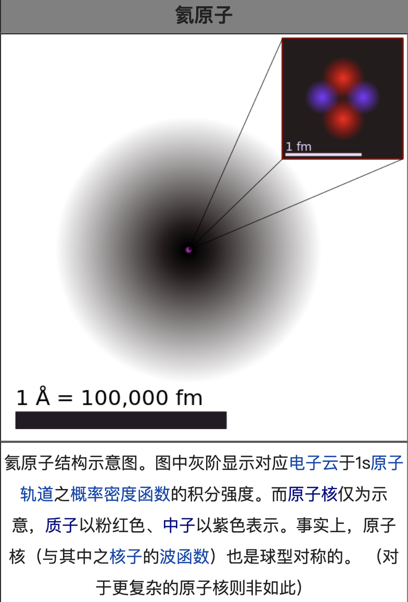
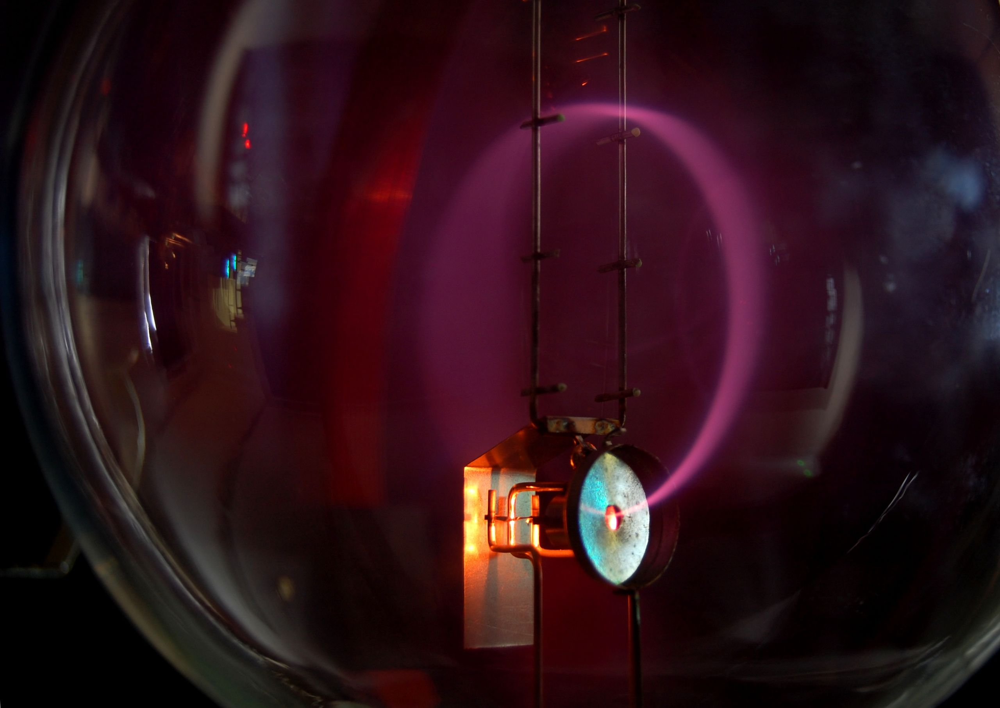
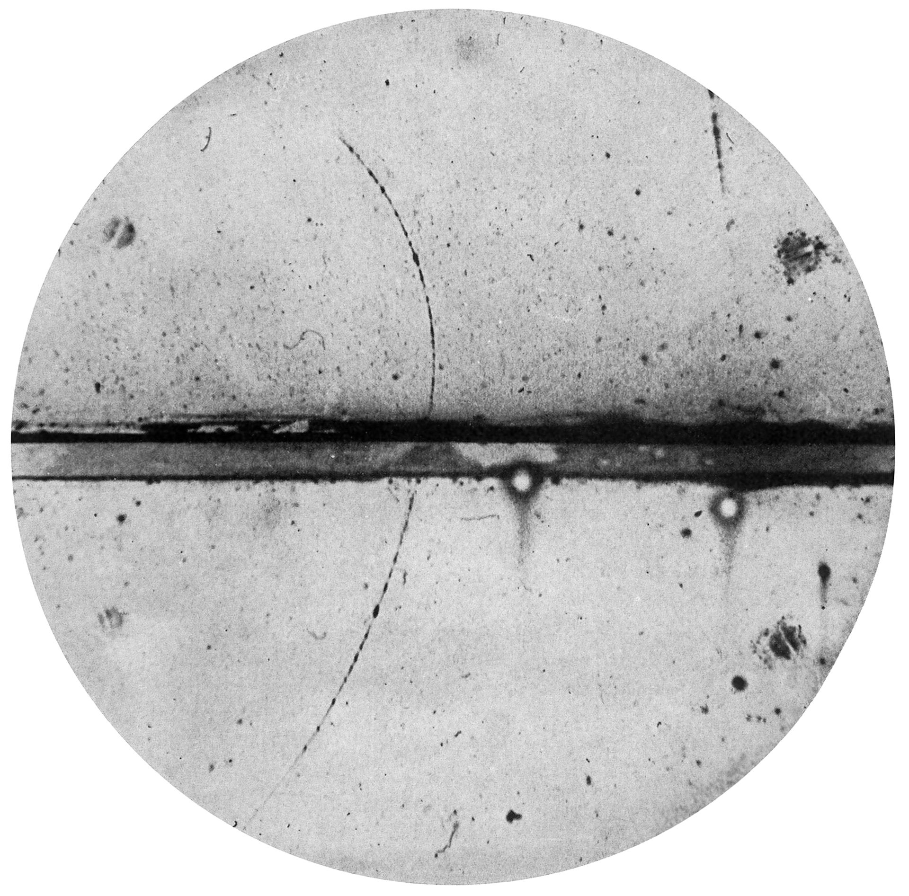

# 原子模型

原子的英文名（Atom），在是从希腊语（atomos，“不可切分的”）转化而来。很早以前，希腊和印度的哲学家就提出了原子的不可切分的概念。 17和18世纪时，化学家发现了元素和倍比定律，对原子提供了物理依据。元素，不能通过化学手段将其继续的分解。倍比定理：若两元素可以生成两种或两种以上的化合物时，在这些化合物中，一元素的质量固定，则另一元素的质量成简单整数比。 19世纪晚期和20世纪早期，物理学家发现了亚原子粒子（电子、质子和中子）以及原子的内部结构，并利用量子力学建立了现代原子模型。 

原子是元素能保持其化学性质的最小单位。原子由原子核和绕核旋转的电子组成。原子核由质子和中子组成。质子带正电荷，电子带负电荷，中子不带电。电子绕原子核高速旋转，电子轨道是量子化的（离散的），电子可以在不同的轨道之间跃迁。

下图是扫描隧道显微镜图片，显示了组成Au（100）的单个金原子。

## 原子大小

- 原子的体积很小，原子半径几十到几百皮米（$1pm = 10^{-12}m$），一根人的头发的直径大约是一百万个原子。   
- 原子核的直径是原子的十万分之一。如果原子放大到一栋楼房大小，原子核就是里面的一粒芝麻。原子核体积随小却了集中了约99.95％的原子质量。
- 电子的半径目前还没有确定答案。根据经典理论，电荷总势能等于$mc^2$,  那么得出电子半径是${2.8}\times{10}^{-15}m$。但是电子有自旋磁矩，照此计算电子表面的速度会远远大于光速。如果假定电子为点粒子，半径为零，则会造成严峻数学困难，因为电子的自能会趋于无穷大。目前从实验数据来看，从观测束缚于潘宁阱内的电子，物理学家推断电子半径的上限为${10}^{-22}$米。可见相对于原子来说，电子也是十分微小的。哪剩余的是什么？空的，对是空的。

## 电子轨道

电子轨道不是像行星绕太阳旋转那样稳定的有形的一个轨道，人们无法测定电子的具体位置，只知道一个在原子核周围空间的电子存在的概率分布。电子有不同的轨道，轨道有三个特征(每个特征都是离散化的，在量子系统里称为量子数)：

能级（n），取值为1，2，3，4，5…. 这是[波尔模型](https://zh.wikipedia.org/wiki/波尔模型)引入的唯一一个量子数。主量子数*n*代表每个轨道上电子的相对总能量（因为势能是相对的）以及距离原子核不同距离的能量差值。相同*n*值所对应的轨道经常被称作原子壳层，对应能量值称为能级。不同主量子数*n*所表示的能级间差值决定了该种元素的[发射光谱](https://zh.wikipedia.org/wiki/發射光譜)。 *K* (*n* = 1), *L* (*n* = 2), *M* (*n* = 3) ……

1889年[瑞典](https://zh.wikipedia.org/wiki/瑞典)[物理学家](https://zh.wikipedia.org/wiki/物理學家)[约翰内斯·里德伯](https://zh.wikipedia.org/wiki/约翰内斯·里德伯)（Johannes Robert Rydberg）将上述各系列谱线归纳出氢原子谱线的经验公式： 维基百科 [https://zh.wikipedia.org/wiki/%E6%B0%AB%E5%8E%9F%E5%AD%90%E5%85%89%E8%AD%9C](https://zh.wikipedia.org/wiki/氫原子光譜)

${\frac {1}{\lambda }}=R({\frac {1}{n^{2}}}-{\frac {1}{n'^{2}}})\qquad n=1,2,3\cdots \quad n'=n+1,n+2,n+3\cdots$

得出

角量子数*ℓ* 从[经典力学](https://zh.wikipedia.org/wiki/經典力學)的概念可知，任何[旋转体](https://zh.wikipedia.org/wiki/旋转体)都有绕轴的[角动量](https://zh.wikipedia.org/wiki/角動量)。它是一个[矢量](https://zh.wikipedia.org/wiki/矢量)。当它不是连续变动时，会取不同的[离散值](https://zh.wikipedia.org/w/index.php?title=離散值&action=edit&redlink=1)，是[量子化](https://zh.wikipedia.org/wiki/量子化)的。在[原子物理](https://zh.wikipedia.org/wiki/原子物理)中，这个量子数决定了[电子云](https://zh.wikipedia.org/wiki/電子雲)的形状。例如，电子所处的{\displaystyle s,p,d,f,g}分别对应的角量子数分别是{\displaystyle l=0,1,2,3,4}，其他情况以此类推。  0- n-1

**磁量子数**（英语：**Magnetic quantum number**）是[电子](https://zh.wikipedia.org/wiki/电子)运动[角量子数](https://zh.wikipedia.org/wiki/角量子数)在{\displaystyle Z}轴投影的[量子数](https://zh.wikipedia.org/wiki/量子数)。当原子受外磁场作用时，原子[光谱](https://zh.wikipedia.org/wiki/光谱)中谱线会由原来一条分为多条，称为能级分裂。这是由于电子的磁量子数决定的电子磁矩空间取向的不同造成的。但磁量子数只能解释[正常塞曼效应](https://zh.wikipedia.org/wiki/正常塞曼效应)

1896年，荷兰物理学家塞曼使用半径10英尺的凹形[罗兰光栅](https://zh.wikipedia.org/w/index.php?title=罗兰光栅&action=edit&redlink=1)观察磁场中的[钠](https://zh.wikipedia.org/wiki/钠)火焰的光谱，他发现钠的D谱线似乎出现了加宽的现象。这种加宽现象实际是谱线发生了分裂。随后不久，塞曼的老师、荷兰物理学家[洛伦兹](https://zh.wikipedia.org/wiki/洛伦兹)应用经典电磁理论对这种现象进行了解释。他认为，由于[电子](https://zh.wikipedia.org/wiki/电子)存在[轨道磁矩](https://zh.wikipedia.org/w/index.php?title=轨道磁矩&action=edit&redlink=1)，并且磁矩方向在空间的取向是量子化的，因此在磁场作用下能级发生分裂，谱线分裂成间隔相等的3条谱线。塞曼和洛伦兹因为这一发现共同获得了1902年的[诺贝尔物理学奖](https://zh.wikipedia.org/wiki/诺贝尔物理学奖)。

对于自旋为零的体系有{\displaystyle g_{1J}=g_{2J}=1}。由于跃迁的[选择定则](https://zh.wikipedia.org/w/index.php?title=选择定则&action=edit&redlink=1){\displaystyle \Delta m_{J}=m_{2J}-m_{1J}=0,\pm 1}，频率ν只有三个数值：

The magnetic quantum number, {\displaystyle m_{\ell }} m_{\ell }, describes the magnetic moment of an electron in an arbitrary direction, and is also always an integer. Within a subshell where {\displaystyle \ell } \ell  is some integer {\displaystyle \ell _{0}} \ell _{0}, {\displaystyle m_{\ell }} m_{\ell } ranges thus: {\displaystyle -\ell _{0}\leq m_{\ell }\leq \ell _{0}} -\ell _{0}\leq m_{\ell }\leq \ell _{0}.

电子轨道表

卢瑟福模型，发现了原子核 （TODO 图片）

wiki 质子：太空里的质子。只有动能足够小才能和电子结合

## 原子的发现

## 原子内部粒子的性质

在研究粒子的过程中，只有确定了某个粒子的性质，我们才知道它属于哪一种粒子，是否是未知的粒子。在微观世界，形状、颜色这些属性都不存在了。物理学家利用三个基本物理性质“质量”、“电荷”和“自旋”来区分粒子。

- 电荷的检测，利用电子倍增管可以容易的检测出粒子所带电荷。电子倍增管是

- 质量的检测，粒子束进入磁场或电场中发生偏转，可以检测出粒子的荷质比，从而测出粒子的质量。

  - 电子在磁场作用下的圆形轨迹，电子和瓶中的气体碰撞发出紫色的光
  - 
  - 

- - 

- - - - 云室
      
    - 
aaaaaaaaaaa

      
      
      - 气泡室  气泡室运作的原理跟云雾室类似，通常是将一个放满液体（一般是液态氢）的容器，之后把它加热接近到沸点，而当带电粒子经过时就加热液体而产生气泡，它的轨迹就会形成一连串的气泡，当气泡膨胀到可看见的大小时，使用照相机把它摄影下来，就可以得到粒子轨迹的图像，这样可以让气泡室的分辨率达到几微米。整个气泡室都被加以磁场，因此只要看粒子轨迹弯曲的程度就可以知道它的质荷比。
      
        
  
- - 还有这种东西电子倍增管。
  - 
  - 自旋  [https://zh.wikipedia.org/wiki/%E6%96%BD%E7%89%B9%E6%81%A9%EF%BC%8D%E6%A0%BC%E6%8B%89%E8%B5%AB%E5%AE%9E%E9%AA%8C](https://zh.wikipedia.org/wiki/施特恩－格拉赫实验)
  - 

- - - 化学成分利用光谱 是不是就是根据自旋计算出来的
    - 核磁共振

- - - - 医学利用的原理

- - - 光谱
    - 银离子实验

- 反物质

- - 正电子
  - 反质子
  - 反氢
  - 医学利用伽马刀
  - 反物质难题
  
  穿过势能壁垒。扫描显微镜原理

电子的发现

质子的发现

中子的发现， 原子核的中子 质子模型

# 原子是怎么组合起来的

## 原子组合

- - 分子
  - [https://zh.wikipedia.org/wiki/%E5%88%86%E5%AD%90](https://zh.wikipedia.org/wiki/分子) --分子光谱学 转动惯量
- - - 分子图
- - 离子晶格
- - - 离子晶格图
    - 隧道显微镜观察到的图片
- - 化学键是怎么回事

参考： 维基百科 [原子半径](https://zh.wikipedia.org/wiki/原子半径)，原子，电子，基本模型，基本粒子，电子显微镜，量子力学入门， [https://zh.wikipedia.org/wiki/%E7%B2%92%E5%AD%90%E6%8E%A2%E6%B5%8B%E5%99%A8](https://zh.wikipedia.org/wiki/粒子探测器)

中科院物理所的文章 [《原子究竟有多小》](http://www.ihep.cas.cn/kxcb/khsl/201709/t20170921_4863078.html)

[https://zh.wikipedia.org/wiki/%E7%B2%92%E5%AD%90%E6%8E%A2%E6%B5%8B%E5%99%A8](https://zh.wikipedia.org/wiki/粒子探测器)

[粒子探测器](https://zh.wikipedia.org/wiki/粒子探测器)

里面有磁偏转，电偏转

[https://zh.wikipedia.org/wiki/%E7%BA%A6%E7%91%9F%E5%A4%AB%C2%B7%E6%B1%A4%E5%A7%86%E5%AD%99](https://zh.wikipedia.org/wiki/约瑟夫·汤姆孙)

https://zh.wikipedia.org/wiki/%E5%80%8D%E6%AF%94%E5%AE%9A%E5%BE%8B](https://zh.wikipedia.org/wiki/倍比定律) 发现了原子

## 

轻子数守恒定律的违反