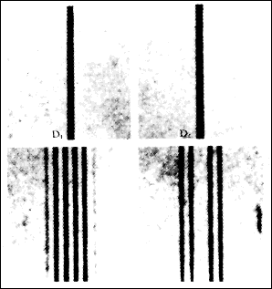
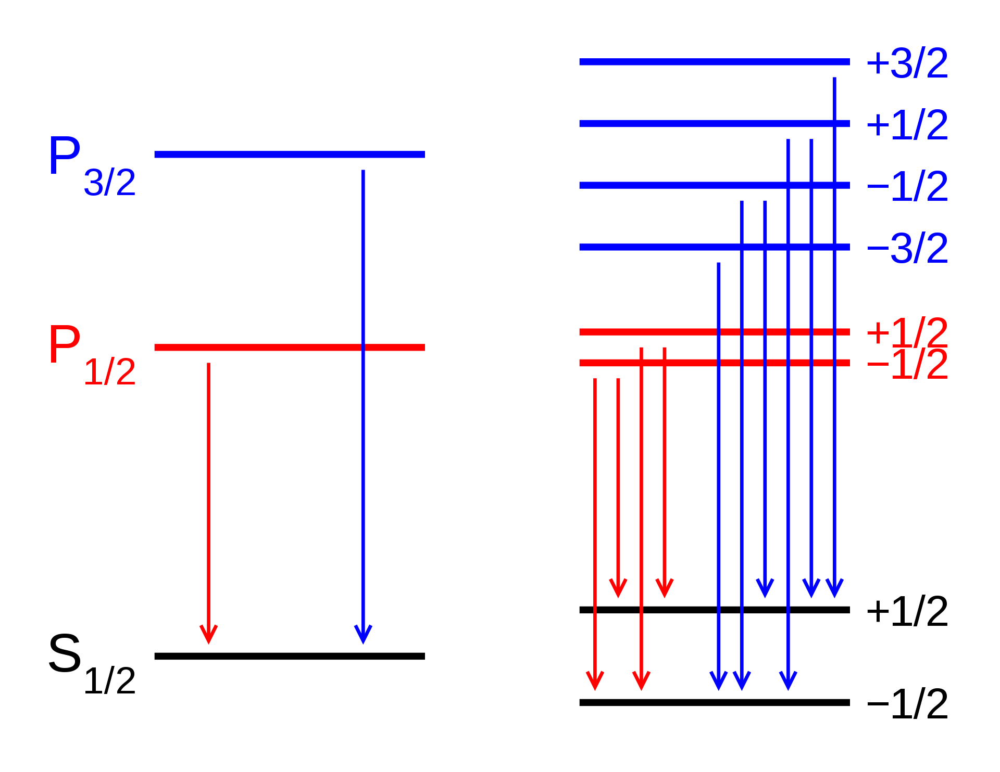
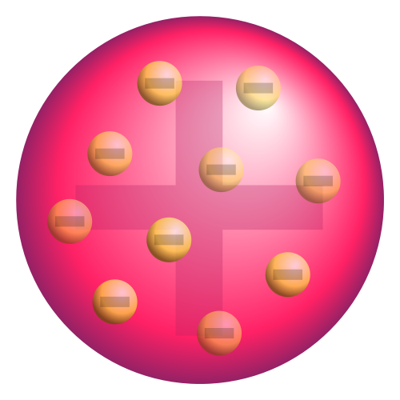

# 原子模型

原子的英文名（Atom），在是从希腊语（atomos，“不可切分的”）转化而来。很早以前，希腊和印度的哲学家就提出了原子的不可切分的概念。 17和18世纪时，化学家发现了元素和倍比定律，对原子提供了物理依据。元素，不能通过化学手段将其继续的分解。倍比定理：若两元素可以生成两种或两种以上的化合物时，在这些化合物中，一元素的质量固定，则另一元素的质量成简单整数比。 19世纪晚期和20世纪早期，物理学家发现了亚原子粒子（电子、质子和中子）以及原子的内部结构，并利用量子力学建立了现代原子模型。 

原子是元素能保持其化学性质的最小单位。原子由原子核和绕核旋转的电子组成。原子核由质子和中子组成。质子带正电荷，电子带负电荷，中子不带电。电子绕原子核高速旋转，电子轨道是量子化的（离散的），电子可以在不同的轨道之间跃迁。

下图是扫描隧道显微镜图片，显示了组成Au（100）的单个金原子。

下图是He 原子的模型

## 原子大小

- 原子的体积很小，原子半径几十到几百皮米（$1pm = 10^{-12}m$），一根人的头发的直径大约是一百万个原子。   
- 原子核的直径是原子的十万分之一。如果原子放大到一栋楼房大小，原子核就是里面的一粒芝麻。原子核体积随小却了集中了约99.95％的原子质量。
- 电子的半径目前还没有确定答案。根据经典理论，电荷总势能等于$mc^2$,  那么得出电子半径是${2.8}\times{10}^{-15}m$。但是电子有自旋磁矩，照此计算电子表面的速度会远远大于光速。如果假定电子为点粒子，半径为零，则会造成严峻数学困难，因为电子的自能会趋于无穷大。目前从实验数据来看，从观测束缚于潘宁阱内的电子，物理学家推断电子半径的上限为${10}^{-22}$米。可见相对于原子来说，电子也是十分微小的。哪剩余的是什么？空的，对是空的。

## 电子轨道

电子轨道不是像行星绕太阳旋转那样稳定的有形的一个轨道，而是电子在原子核周围空间出现的概率分布，人们无法测量电子的具体位置。电子有不同的轨道，轨道有三个特征 ，每个特征都是离散化的，在量子系统里称为量子数。准确理解和定义量子数需要量子力学的知识，而且比较抽象。但是在现代量子力学出现以前，人们结合经典力学以及早期的量子思想，得出了近似的结论。这里我们暂且按照早期的近似结论来理解。
- 主量子数：代表轨道的不同能级。电子离原子核越远，能级越高。主量子数代表轨道上电子的总能量以及距离原子核不同距离（电子距离原子核越远，能级越大）。用小写字母$n$表示，取值为1，2，3，4，5(记做：K层，L层，M层，N层…..)，目前最多有5层。 相同主量子数所对应的轨道经常被称作“原子壳层”或“电子层”。

  $\displaystyle E=-{\frac {m_{e}e^{4}}{8\varepsilon _{0}^{2}h^{2}}}\ {\frac {1}{n^{2}}}$

  $h$ 是普朗克常数，即光子的能量与频率的比值。 ${h}/{2\pi}$记为 $\hbar$。

- 角量子数：代表电子轨道不同的角动量。根据经典力学的观点，在同一能级内的电子的轨道有不同的形状，也就有着不同的角动量。用*$l$*表示。同一电子层下，相同的角量子数对应的轨道被称为“原子亚层”。取值为 0，1，2,  3… $n-1$，记为($s,p,d,f,g,h$)。它的名称源于对其原子光谱特征谱线外观的描述，分为锐系光谱（sharp）、主系光谱（principal）、漫系光谱（diffuse）、基系光谱（fundamental），其余则依字母序命名（跳过j）。例如：$n=1, l=0$的轨道记为2s。

  在量子力学中：$ L=\hbar {\sqrt {l (l +1)}}$， 在经典力学中： $L=l\hbar$ 。可以看到两者还是比较接近的

- 磁量子数：电子轨道角动量在某一方向上的分量。由于角动量有不同的方向，所以在某一个特定方向上的分量会不同。用$m$表示，取值范围是$-l, -l+1,…,0, …, l-1, l$（如果$l$为0，$m$也为0）。角动量的测量是通过外加磁场，测量外加磁场方向上的磁矩来完成的。所以叫做“磁量子数”。一般把磁场方向记做z轴

  $\displaystyle L_{z}=m\hbar$
  

每个电子轨道有以上三个量子数($n,l,m$)决定。每个轨道最多含有两个电子，同一轨道中的电子的“自旋”必定相反。一个自旋是$+{\frac {1}{2}}$，另一个是$-{\frac {1}{2}}$。下面引出决定电子状态的最后一个量子数：自旋量子数。

- 粒子的自旋：科学家们发现电子本身带有磁矩。如果把电子看作一个带电的球体，磁矩意味着电子在自旋。后来透过理论以及实验验证发现电子是一种基本粒子，基本粒子可视为是不可分割的点粒子。所以电子自旋是电子的内禀（内在的、固有的）属性，与经典力学中的自转从本质上完全不同。后来发现质子、中子等诸多粒子都有自旋。自旋角动量的运算规则类似轨道角动量。

  粒子的自旋角度量是：$\displaystyle S=\hbar \,{\sqrt {s(s+1)}}$      $ s \in {0, \frac{1}{2}, 1, \frac{3}{2}….}$。 $s$记为粒子的自旋量子数

  但是粒子的自旋的大小是固定的，不可改变。但粒子自旋的方向可以改变。即$Z$轴（外部磁场方向）自旋的投影可变的。 $S_z = \hbar s_z \quad s_z \in \{ - s, -(s-1), \dots, s - 1, s \} $。$s_z$记为粒子的自旋投影量子数（Spin projection quantum number ）。
  
  比如，电子的自旋量子数是1/2,  电子的自旋投影量子数是 +1/2 或 -1/2。而 delta baryon（一种通过加速器合成的粒子）的自旋量子数是3/2, 自旋投影量子数是 -3/2，-1/2，1/2，3/2。

# 发现过程

## 氢原子光谱的研究

### 马耳末公式

巴耳末系落在可见光区域内的4条谱线，在最右边的红线即为Hα

巴耳末的公式可以用来发现吸收或发射谱线，最初被提出来的形式如下（仅有的不同是将巴耳末常数的标示改为*B*）：

此处

### 里德伯公式

1889年，瑞典物理学家约翰内斯·里德伯将上述各系列谱线归纳出氢原子谱线的经验公式：

${\frac {1}{\lambda }}=R({\frac {1}{n^{2}}}-{\frac {1}{n'^{2}}})\qquad n=1,2,3\cdots \quad n'=n+1,n+2,n+3\cdots$

### 塞曼效应

1896年，荷兰物理学家塞曼使用半径10英尺的凹形[罗兰光栅](https://zh.wikipedia.org/w/index.php?title=罗兰光栅&action=edit&redlink=1)观察磁场中的[钠](https://zh.wikipedia.org/wiki/钠)火焰的光谱，他发现钠的D谱线似乎出现了加宽的现象。这种加宽现象实际是谱线发生了分裂。随后不久，塞曼的老师、荷兰物理学家[洛伦兹](https://zh.wikipedia.org/wiki/洛伦兹)应用经典电磁理论对这种现象进行了解释。他认为，由于[电子](https://zh.wikipedia.org/wiki/电子)存在[轨道磁矩](https://zh.wikipedia.org/w/index.php?title=轨道磁矩&action=edit&redlink=1)，并且磁矩方向在空间的取向是量子化的，因此在磁场作用下能级发生分裂，谱线分裂成间隔相等的3条谱线。塞曼和洛伦兹因为这一发现共同获得了1902年的[诺贝尔物理学奖](https://zh.wikipedia.org/wiki/诺贝尔物理学奖)。

1897年12月，普雷斯顿（T.Preston）报告称，在很多实验中观察到光谱线有时并非分裂成3条，间隔也不尽相同，人们把这种现象叫做为**反常塞曼效应**，将塞曼原来发现的现象叫做**正常塞曼效应**。反常塞曼效应的机制在其后二十余年时间里一直没能得到很好的解释，困扰了一大批物理学家。1925年，两名荷兰学生[乔治·乌伦贝克](https://zh.wikipedia.org/wiki/乔治·乌伦贝克)（G.E.Uhlenbeck,1900-1974）和[撒姆尔·高斯密特](https://zh.wikipedia.org/w/index.php?title=撒姆爾·高斯密特&action=edit&redlink=1)（S.A.Goudsmit,1902-1978）提出了[电子](https://zh.wikipedia.org/wiki/电子)[自旋](https://zh.wikipedia.org/wiki/自旋)假设，很好地解释了反常塞曼效应。

## 电子的发现

直接引用维基百科“[剑桥大学](https://zh.wikipedia.org/wiki/剑桥大学)[卡文迪许实验室](https://zh.wikipedia.org/wiki/卡文迪许实验室)的[约瑟夫·汤姆孙](https://zh.wikipedia.org/wiki/约瑟夫·汤姆孙)于1897年重做赫兹的1883年实验。使用真空度更高的真空管和更强的电场，他观察出阴极射线的偏转，并计算出组成阴极射线的粒子的[荷质比](https://zh.wikipedia.org/wiki/電荷質量比)。由于这数值与阴极物质、放电管内气体无关，汤姆孙推断阴极射线的粒子源自于在阴极附近被强电场分解的气体原子，这粒子为所有物质的组分。由于这数值是电解实验获得的氢离子荷质比的千分之一倍，汤姆孙错误推断，这粒子的质量很小，电荷很大，稍后修正为，粒子的带电量等于[电解](https://zh.wikipedia.org/wiki/電解)单位电荷，而质量则为氢原子的千分之一。汤姆孙称这粒子为“微粒”（corpuscle），就是微小粒子的意思。[[19\]](https://zh.wikipedia.org/wiki/电子#cite_note-22)这是为了要与术语“电子”有所区别，在那时期，电子指的仍旧是斯桐尼的基本电量，而不是一种物质。不久之后，[乔治·费兹杰罗](https://zh.wikipedia.org/wiki/喬治·費茲傑羅)不同意地表示，阴极射线的粒子实际就是“自由电子”，即没有实体的电荷，他强调，这粒子不是原子的组分，原子是无法分解的，物理学者不应该重蹈[炼金术](https://zh.wikipedia.org/wiki/煉金術)覆辙。后来，由于费兹杰罗、[约瑟夫·拉莫尔](https://zh.wikipedia.org/wiki/约瑟夫·拉莫尔)、[亨德里克·洛伦兹](https://zh.wikipedia.org/wiki/亨德里克·勞侖茲)等人大力推行，学术界选择采用术语“电子”来称呼新发现的粒子。[[15\]](https://zh.wikipedia.org/wiki/电子#cite_note-O'Hara1975-18):273[[注 4\]](https://zh.wikipedia.org/wiki/电子#cite_note-23)1899年，汤姆孙实验团队做光电效应实验与热离子发射实验测得于先前阴极射线等同的荷质比，这意味着这些实验所涉及的粒子都是电子。[[14\]](https://zh.wikipedia.org/wiki/电子#cite_note-buchwald1-17):23由于汤姆孙建议电子为组成物质的基础粒子，并且做实验确切证实他的论述，他被公认为电子的发现者。电子是人类发现的第一种[基础粒子](https://zh.wikipedia.org/wiki/基礎粒子)。”

- 电子在磁场作用下的圆形轨迹，电子和瓶中的气体碰撞发出紫色的光
  

## 汤姆孙模型

直接引用维基百科: 1904年，汤姆孙在《哲学杂志》发表的论文《论原子的结构》里，提出了描述原子内部结构的梅子布丁模型，根据这模型，原子是由许多带负电的电子悬浮于带正电物质里所组成，就好像带梅子散布于布丁里一般。带负电的电子与带正电物质的电性相互抵消，因此原子呈电中性。

## 卢瑟福模型

直接引用维基百科: 1909年，卢瑟福领导设计与完成[卢瑟福散射实验](https://zh.wikipedia.org/wiki/拉塞福散射)，其证实了在[原子](https://zh.wikipedia.org/wiki/原子)中心部分有一个带正电、带质量的[原子核](https://zh.wikipedia.org/wiki/原子核)，因此[约瑟夫·汤姆孙](https://zh.wikipedia.org/wiki/约瑟夫·汤姆孙)主张的[梅子布丁模型](https://zh.wikipedia.org/wiki/梅子布丁模型)被彻底推翻。卢瑟福根据他的实验结果设计出一种新模型，称为“卢瑟福模型”，其拥有几个重要的特色：大多数的质量和正[电荷](https://zh.wikipedia.org/wiki/電荷)，都集中于位于中心区域、半径极小的原子核，而[电子](https://zh.wikipedia.org/wiki/電子)则环绕在原子核的外面。

上方：预期结果：阿尔法粒子不受到扰动地通过梅子布丁模型。下方：观测结果：一小部分阿尔法粒子被反弹，表明全部正电荷集中于一个很小的区域。

然而卢瑟福模型不能给出电子的排列方式，也无法对化学结合、元素列表、原子谱线给出解释。

## 玻尔模型

1913年玻尔在卢瑟福模型基础上，引入了普朗克的量子概念，根据巴耳末公式（氢原子谱线波长的经验公式），得出玻尔原子模型。巴耳末公式是里德伯公式的一种特殊形式，下面我们用里德伯公式推导。

下图是氢光谱的序列，坐标采用对数标尺

玻尔假定电子绕原子核做圆周运动，库仑力提供向心力。并得出了上式中的$n, n'$ 就是电子绕原子核旋转的角动量的份数。

可得出：

- 轨道半径 $\displaystyle r={\frac {4\pi \varepsilon _{0}\hbar ^{2}}{m_{e}e^{2}}}n^{2}$ 

- 轨道能量 $\displaystyle E=-{\frac {m_{e}e^{4}}{8\varepsilon _{0}^{2}h^{2}}}\ {\frac {1}{n^{2}}}\approx -{\frac {13.60eV}{n^{2}}}$   由于E中的势能部分是负的，并且绝对值大于动能部分，所以E整体是负的。

- 里德伯常数 $\displaystyle R={\frac {m_{e}e^{4}}{8\varepsilon _{0}^{2}h^{3}c}}$ 

  

玻尔模型解释了当时发现的一系列谱线，并预言了某些谱线的出现，例如类氢离子He+，氢的同位素氘的光谱。

玻尔模型的局限性在于，假定电子做圆周运动，所以$n$既是角动量量子数又是能级量子数。后来实验证明氢原子电子的角动量为0（因为只有1s）。但是玻尔模型的能级量子数是正确的。

### 索末菲模型

1916年索末菲在玻尔模型的基础上将圆轨道推广为椭圆形轨道，并在波尔模型的角动量量子化的基础上加入了径向动量量子化。

- 假定：径向动量在从近拱点到远拱点的积分是$kh$， $k\geq 0$是一个新的量子数。

- 根据开普勒第二定律，椭圆轨道的角动量守恒。假定：角动量$L=l\hbar$,

根据哈密顿力学，可得

- $\displaystyle E=-{\frac  {1}{2(k+l)^{2}\hbar ^{2}}}$。可见：主量子数$\displaystyle n = k + l$。由于$k$是非负整数，$l$的容许值必须小于或等于$n$。(根据更加精确的量子力学的模型$l$最大取$n-1$)

- 还有$\displaystyle \frac k{k+l} = \frac b{a}$ , b为椭圆的短半径，a为椭圆的长半径。

$n=5$的电子轨道。注意$l=0$的轨道角度量为0。

利用球坐标系，可以计算出角动量在Z轴投影，即磁量子数。

https://zh.wikipedia.org/wiki/正常塞曼效应)

## 量子力学模型

于1924年，克拉莫发表了量子色散理论，借着运动轨道的傅里叶分量，可以计算从一个量子态跃迁至另一个量子态的概率[10]。通过与海森堡的合作，这点子被延伸为一个半经典的，以类似矩阵的形式来描述的原子跃迁概率[13]。海森堡继续这研究，以这跃迁方法来重新表述量子理论，原创出矩阵力学[14]。  同样于1924年，德布罗意提出物质的波动理论。在1926年，薛定谔找到了一个量子波动方程，能够清楚明了，前后一致地复制旧量子论的所有成果。后来，薛定谔证明了他的波动力学和海森堡矩阵力学是等价的。波动力学和矩阵力学共同结束了旧量子论的时代。   

1925年，泡利发表论文正式提出泡利原理，以禁令的形式表示如下：[12] 

在泡利原理被发表的那年，海森堡创建了矩阵力学。隔年，薛定谔发展出波动力学。这两个创举标志了现代量子力学的诞生。后来，海森堡与狄拉克分别提出了全同粒子的概念。在经典力学里，可以单独地跟踪与辨认每一个粒子；在量子力学里，由于不确定性原理，无法准确的跟踪任何粒子，又由于在每一种粒子里，所有粒子都完全相同，无法辨认出哪个粒子是哪个粒子。因此，全同粒子的概念是经典力学与量子力学的一个重要分水岭   

电子轨道表

## 自旋

[https://en.wikipedia.org/wiki/Stern%E2%80%93Gerlach_experiment](https://en.wikipedia.org/wiki/Stern–Gerlach_experiment)

### 质子的发现

1经过很长一段时期，类似氢原子的粒子参与组成了其他原子的概念才被发展出来。早在1815年，[威廉·普劳特](https://zh.wikipedia.org/w/index.php?title=威廉·普勞特&action=edit&redlink=1)提议，所有原子是由氢原子构成，普劳特注意到各种气体的密度大约为氢气密度的整数倍数。[[a\]](https://zh.wikipedia.org/wiki/質子#cite_note-36)[[36\]](https://zh.wikipedia.org/wiki/質子#cite_note-37)这被称为[普劳特假设](https://zh.wikipedia.org/w/index.php?title=普勞特假設&action=edit&redlink=1)的提议启发物理学者进一步论述，完成很多更精确的相关实验，改善出[原子量](https://zh.wikipedia.org/wiki/原子量)的概念，并且测得准确的[原子量](https://zh.wikipedia.org/wiki/原子量)，从而证实普劳特假设不正确。[[37\]](https://zh.wikipedia.org/wiki/質子#cite_note-Lecturer2006-38):39-42

[欧根·戈尔德斯坦](https://zh.wikipedia.org/wiki/欧根·戈尔德斯坦)在1886年发现[阳极射线](https://zh.wikipedia.org/w/index.php?title=陽極射線&action=edit&redlink=1)，并且展示出它们是由气体产生的带正电粒子（离子）所形成。但是，因为从不同气体产生的粒子拥有不同的[荷质比](https://zh.wikipedia.org/wiki/電荷質量比)，它们不能被归根为单独一种粒子，在这方面，这粒子与[约瑟夫·汤姆孙](https://zh.wikipedia.org/wiki/約瑟夫·湯姆森)所发现的电子不同，从不同气体产生的“电子”拥有相同的[荷质比](https://zh.wikipedia.org/wiki/電荷質量比)。[[38\]](https://zh.wikipedia.org/wiki/質子#cite_note-isbn0-941901-31-9-39):4

卢瑟福在1911年的第一次[索尔维会议](https://zh.wikipedia.org/wiki/索尔维会议)

[欧内斯特·卢瑟福](https://zh.wikipedia.org/wiki/欧内斯特·卢瑟福)于1911年做实验发现，在每个原子的中心有一个原子核。在这之后，[安东尼斯。范登布勒克](https://zh.wikipedia.org/w/index.php?title=安東尼斯。范登布勒克&action=edit&redlink=1)发布论文表示，在[周期表](https://zh.wikipedia.org/wiki/週期表)里，每个元素的位置等于它的[核电荷](https://zh.wikipedia.org/wiki/核電荷)。1913年，[亨利·莫塞莱](https://zh.wikipedia.org/wiki/亨利·莫塞莱)使用[X-射线谱](https://zh.wikipedia.org/w/index.php?title=X-射線譜&action=edit&redlink=1)证实了这论述。[[37\]](https://zh.wikipedia.org/wiki/質子#cite_note-Lecturer2006-38):167, 171, 182

1919年，卢瑟福做实验证实，氢原子核存在于其它种原子核内，因此他被公认为质子的发现人。之前，卢瑟福研究出怎样从[α粒子](https://zh.wikipedia.org/wiki/Α粒子)与[氮气](https://zh.wikipedia.org/wiki/氮氣)的碰撞制成氢原子核，并且找到能够辨识与分离氢原子核射线的方法：恰当厚度的[银](https://zh.wikipedia.org/wiki/銀)箔纸能够阻挡α射线，只让氢原子核射线通过，当这些氢原子核击撞于[硫化锌](https://zh.wikipedia.org/wiki/硫化锌)时会产生闪烁信号，显示出氢原子核的位置，在[磁场](https://zh.wikipedia.org/wiki/磁場)里，氢原子核有其特征的轨道，借此可以肯定其身份。卢瑟福在做实验时注意到，当α射线入射于空气之时，[闪烁器](https://zh.wikipedia.org/wiki/閃爍器)会显示出氢原子核抵达某特征位置。经过多次实验，卢瑟福追踪到是因为空气中的氮原子造成这现象，当α射线入射于纯氮气之时，产生的现象更为明显，[氧气](https://zh.wikipedia.org/wiki/氧氣)、[二氧化碳](https://zh.wikipedia.org/wiki/二氧化碳)、[水蒸气](https://zh.wikipedia.org/wiki/水蒸氣)等等都不会造成这现象。卢瑟福推断，氢原子核只能够源自于氮原子，因此，氮原子肯定含有氢原子核；当α粒子撞击于氮原子时，会从氮原子里击撞出一个氢原子核。这是首次被公布的核子反应。后来，于 1924年，使用[云室](https://zh.wikipedia.org/wiki/云室)，证实这反应为[[39\]](https://zh.wikipedia.org/wiki/質子#cite_note-Reeves2008-40):97-98[[40\]](https://zh.wikipedia.org/wiki/質子#cite_note-Kragh2002-41):175-176

wiki 质子：太空里的质子。只有动能足够小才能和电子结合

### 中子的发现，

[https://zh.wikipedia.org/wiki/%E4%B8%AD%E5%AD%90#%E4%B8%AD%E5%AD%90%E7%9A%84%E7%99%BC%E7%8F%BE](https://zh.wikipedia.org/wiki/中子#中子的發現)

参考： 维基百科 [原子半径](https://zh.wikipedia.org/wiki/原子半径)，原子，电子，基本模型，基本粒子，电子显微镜，量子力学入门， [https://zh.wikipedia.org/wiki/%E7%B2%92%E5%AD%90%E6%8E%A2%E6%B5%8B%E5%99%A8](https://zh.wikipedia.org/wiki/粒子探测器)

中科院物理所的文章 [《原子究竟有多小》](http://www.ihep.cas.cn/kxcb/khsl/201709/t20170921_4863078.html)

[https://zh.wikipedia.org/wiki/%E7%B2%92%E5%AD%90%E6%8E%A2%E6%B5%8B%E5%99%A8](https://zh.wikipedia.org/wiki/粒子探测器)

[粒子探测器](https://zh.wikipedia.org/wiki/粒子探测器)

里面有磁偏转，电偏转

[https://zh.wikipedia.org/wiki/%E7%BA%A6%E7%91%9F%E5%A4%AB%C2%B7%E6%B1%A4%E5%A7%86%E5%AD%99](https://zh.wikipedia.org/wiki/约瑟夫·汤姆孙)

https://zh.wikipedia.org/wiki/%E5%80%8D%E6%AF%94%E5%AE%9A%E5%BE%8B](https://zh.wikipedia.org/wiki/倍比定律) 发现了原子

[https://zh.wikipedia.org/wiki/%E8%88%8A%E9%87%8F%E5%AD%90%E8%AB%96](https://zh.wikipedia.org/wiki/舊量子論)

[https://zh.wikipedia.org/wiki/%E6%A2%85%E5%AD%90%E5%B8%83%E4%B8%81%E6%A8%A1%E5%9E%8B](https://zh.wikipedia.org/wiki/梅子布丁模型)

[https://zh.wikipedia.org/wiki/%E5%BC%80%E6%99%AE%E5%8B%92%E5%AE%9A%E5%BE%8B](https://zh.wikipedia.org/wiki/开普勒定律)

[http://cs.gzedu.com/jiaoshijixu/dbsd8/jxjy006/intro/ziliaoku/xueshi/%E7%AC%AC%E5%85%AB%E7%AB%A0%E7%AC%AC%E5%9B%9B%E8%8A%822.htm](http://cs.gzedu.com/jiaoshijixu/dbsd8/jxjy006/intro/ziliaoku/xueshi/第八章第四节2.htm)

 [https://zh.wikipedia.org/wiki/%E5%BC%80%E6%99%AE%E5%8B%92%E5%AE%9A%E5%BE%8B](https://zh.wikipedia.org/wiki/开普勒定律)

